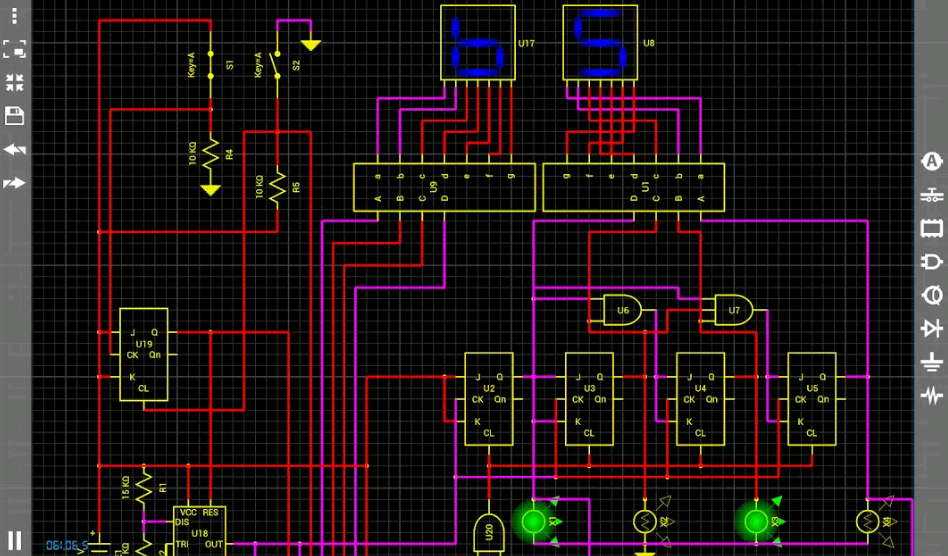
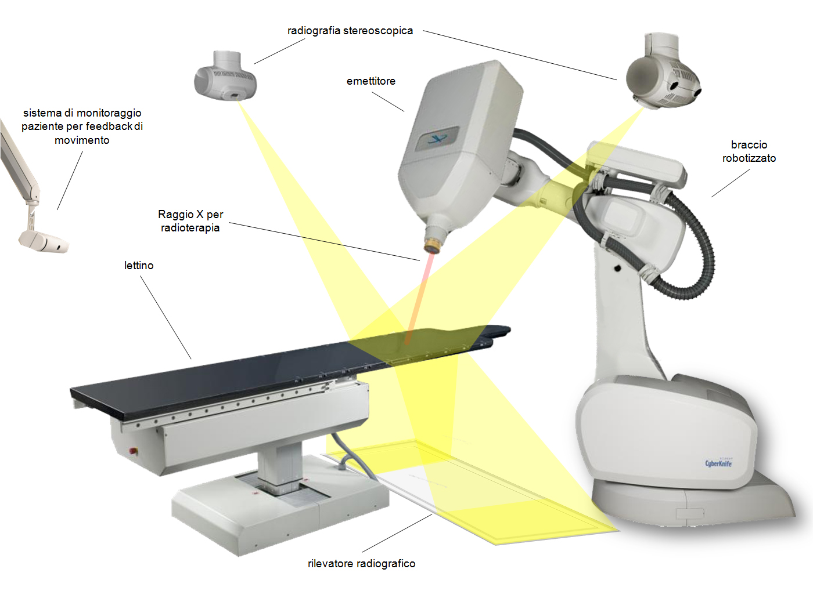

# Content
Topic: **Electrical Engineering**

## Existing Technology in Electrical Engineering
  * [Droid Tesla](https://www.solopointsolutions.com/2017/11/14/must-have-apps-for-electrical-engineers/)
    
    * This app is the only electronic circuit simulator for android.
    * This app solves basic circuits using Kirchoff's Current law (KCL)
    * This simulator forms a matrix according to KCL
    * Then starts to solve for the unknown quantities using algebraic technologies.
    * This app is also free
    * This app is also suitable for all types of being like students, hobbyists, and professionals.
  *  [Engineering Unit Convertor & Calculator](https://www.solopointsolutions.com/2017/11/14/must-have-apps-for-electrical-engineers/)
     
    * This app is a tool that converts measurments between different units.
    * Such as meters to miles and Pascals to Psi
    * Easy to read text with an intelligent, customizable display system.
    * This tool is essential for hanndling complex calculations and avoiding mistakes
  * [CyberKnife](https://cyberknife.com/cyberknife-how-it-works/)
    
     * This device/system is a non-invasive treatment for cancerous and non-cancerous tumors and other conditions where radiation therapy is indicated.
     * This device/system is used for treating conditions throughout the body, including the prostate, lung, brain, spine, head and neck, liver, pancreas and kidney.
     * This can also be used as an alternative to surgery or for patients who have inoperable or surgically complex tumors.
     * This CyberKnife treatment is typically performed in 1-5 sessions.
     * The CyberKnife System is the only radiation delivery system that features a linear accelerator (linac).
     * This is directly set on a robot to deliver the high-energy x-rays or photons used in radiation therapy.
     * The robot moves and bends around the patient, to deliver radiation doses from potentially thousands of unique beam angles.
     * This significantly expands the possible positions to concentrate radiations to the tumor.
     * It also does so while minimizing dose to surrounding healthy tissue.
     * This robotic delivery and real-time image guidance have set the standard for delivery precision.
     * It has also enabled stereotactic radiosurgery (SRS) and stereotactic body radiation therapy (SBRT) treatments for the full range of tumor types.
     * The advanced motion synchronization technology eliminates the need to use uncomfortable patient restraints, or ask patients to hold their breath for example.
     * The CyberKnife System has more than two decades of clinical proof and has helped thousands of cancer patients.
  ## Future Possible Inovaations in Electrical Engineering
* Creation of robots that collect garbage:
  * Collected garbage from trash cans
  *Collects litter which is garbage that was littered on the streets.
  *This will help decrease the pollution in many areas around the world.

* System that warns electioneers of surges:
  * Predicts when a surge is going to happen
  * Try's warning them as best as possible by making loud signals
  * Try's to prevent the surges from happening overall 
  
